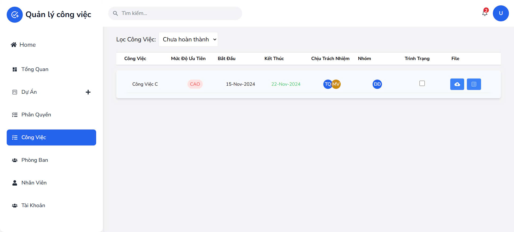
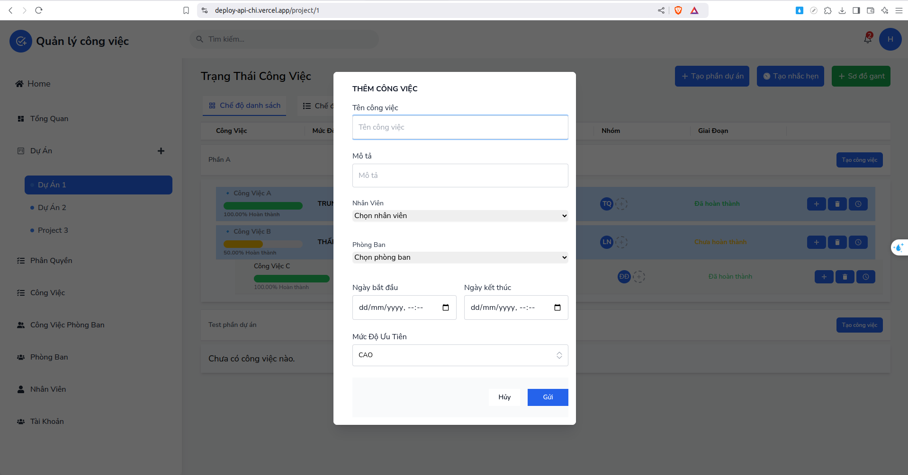
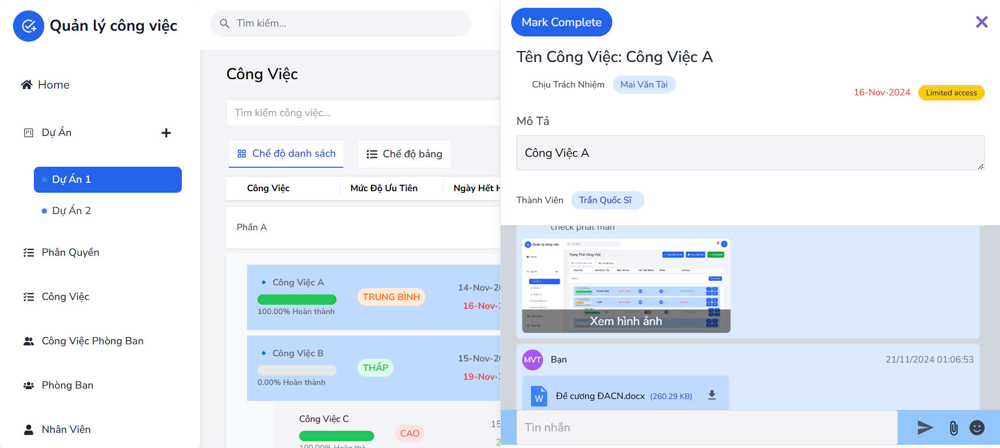
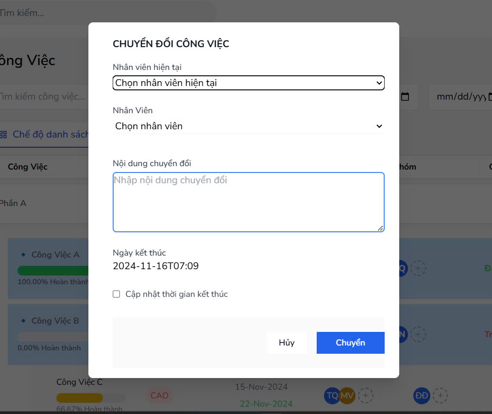
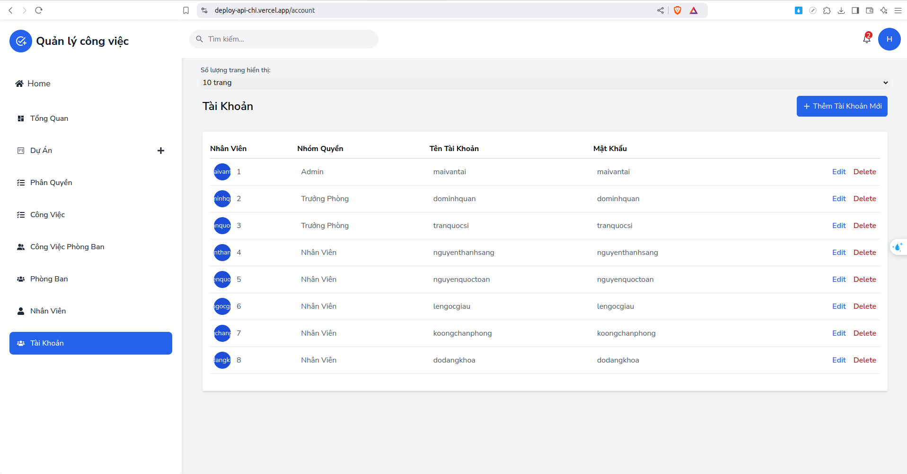

## Run project
### Requierment
- Dotnet version 8 or later
- Nodejs v20.15.0 or later
### Installation
1. Clone this project
```bash
# Backend
git clone https://github.com/maivantai2003/Job_assignment_management.git

# Frontend
git clone https://github.com/Khoadangdo123/QLPB.git

```
2. Run server (You can do this step on IDE like Visual Studio)
Change connectionString on Job_assignment_management.Api/appsettings.json
```json
{
"ConnectionStrings": {
    "Connection": "Data Source=[YOUR_SERVER_NAME];Initial Catalog=FinalAssignmentManagement;Integrated Security=True;Encrypt=True;Trust Server Certificate=True"
  }
```
If your use user-password server
```json
    "ConnectionStrings":  {
"Connection":  "Data Source=[YOUR_SERVER_NAME];Initial Catalog=TestJobAssignmentManagement;User Id=sa;Password=[YOUR_PASSWORD];Encrypt=True;Trust Server Certificate=True"

},
```

Set Default Project
1. Open Package Manager Console (go to Tools > NuGet Package Manager > Package Manager Console).

2. In the Package Manager Console, look for the dropdown labeled Default project on the right-hand side.

3. Select Job_assignment_management.Infrastructure as the Default Project.

Run Commands

```bash
# Create a Migration
Add-Migration InitialCreate

# Update the Database
Update-Database
```

Important Notes

- Make sure Job_assignment_management.Api is set as the Startup Project in Visual Studio (right-click the project > select Set as Startup Project).
- Ensure the correct connection string is configured in the appsettings.json or appsettings.Development.json file of the API project.

3. Run Client

Install dependencies and run app:
```bash
npm install

npm run dev
```

## Demo
**Task management**






**Project management**




**Department management**


**Employee management**


**Account management**



Author:

| Leader          | Member         | Member         | Member            | Member           | Member         |
|-----------------|----------------|----------------|-------------------|------------------|----------------|
|Mai Văn Tài      | Lê Ngọc Giàu   | Đỗ Minh Quân   | Nguyễn Thanh Sang | Nguyễn Quốc Toàn | Trần Quốc Sĩ   |


#### Contact email:
- [vantai08122003@gmail.com](mailto:vantai08122003@gmail.com)
- [lengocgiau2k3@gmail.com](mailto:lengocgiau2k3@gmail.com)
- [dominhquan15623@gmail.com](mailto:dominhquan15623@gmail.com)
- [sangthanhnguyen2910@gmail.com](mailto:sangthanhnguyen2910@gmail.com)
- [ngquoctoan2001@gmail.com](mailto:ngquoctoan2001@gmail.com)
- [quocsi014@gmail.com](mailto:quocsi014@gmail.com)
