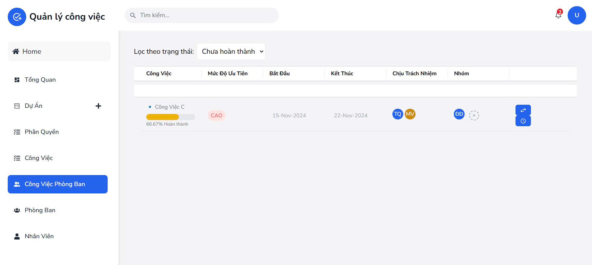
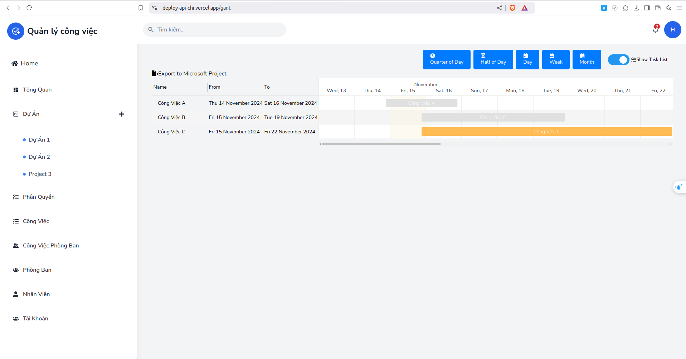
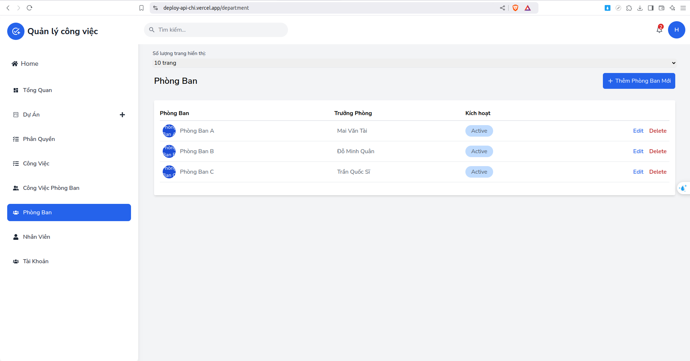
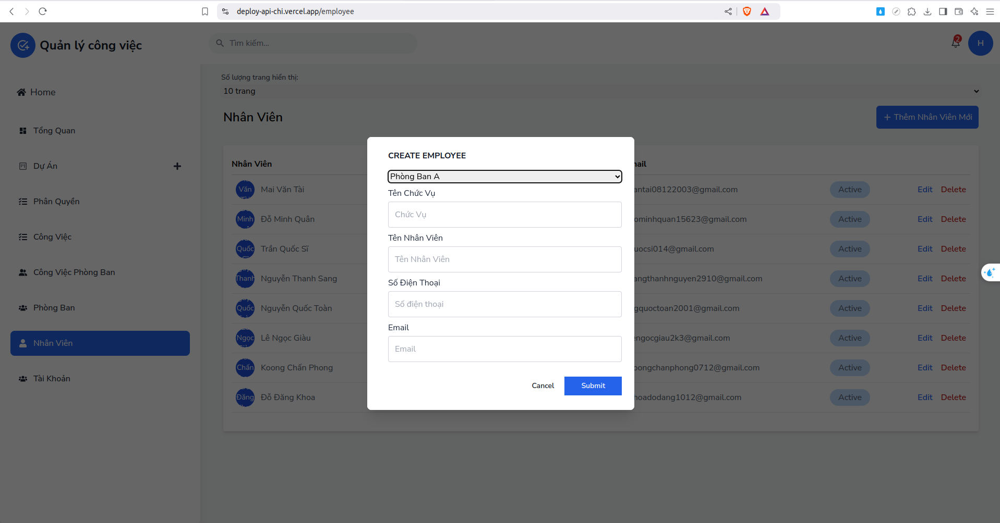

## Overview
Task Management System is an application that helps users organize, track and manage personal and team tasks or projects effectively. The application provides intuitive and easy-to-use features to optimize workflow, increase productivity and improve collaboration among team members.
## Features
- Authentication & Authorization
- Department management
- Staff management
- Task management
- Notification 
## Build with
 
  


## Run project
### Requierment
- Dotnet version 8 or later
- Nodejs v20.15.0 or later
### Installation
1. Clone this project
```bash
git clone https://github.com/maivantai2003/Job_assignment_management.git
```
2. Run server (You can do this step on IDE like Visual Studio)
Change connectionString on Job_assignment_management.Api/appsettings.json
```json
{
"ConnectionStrings": {
    "Connection": "Data Source=[YOUR_SERVER_NAME];Initial Catalog=FinalAssignmentManagement;Integrated Security=True;Encrypt=True;Trust Server Certificate=True"
  }
  //if your use user-password server
    "ConnectionStrings":  {
"Connection":  "Data Source=[YOUR_SERVER_NAME];Initial Catalog=TestJobAssignmentManagement;User Id=sa;Password=[YOUR_PASSWORD];Encrypt=True;Trust Server Certificate=True"

},
```
Migration
```bash
#install dotnet-ef if you don not have
dotnet tool install --global dotnet-ef 

#migration
dotnet ef migrations add [migration-name] --project Job_assignment_management.Infrastructure/Job_assignment_management.Infrastructure.csproj --startup-project Job_assignment_management.Api/Job_assignment_management.Api.csproj -o Job_assignment_management.Infrastructure/Migrations
dotnet ef database update --project Job_assignment_management.Infrastructure/Job_assignment_management.Infrastructure.csproj --startup-project Job_assignment_management.Api/Job_assignment_management.Api.csproj

#restore pakages
dotnet restore

#build
dotnet build

#run
dotnet run
```
3. Run client
```bash
cd client

npm install

npm run dev
```

## Demo
**Task management**




**Project management**


**Department management**


**Employee management**


**Account management**


